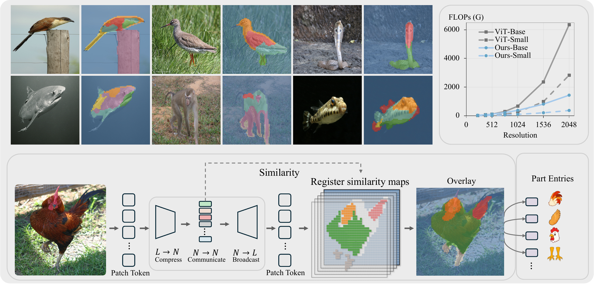
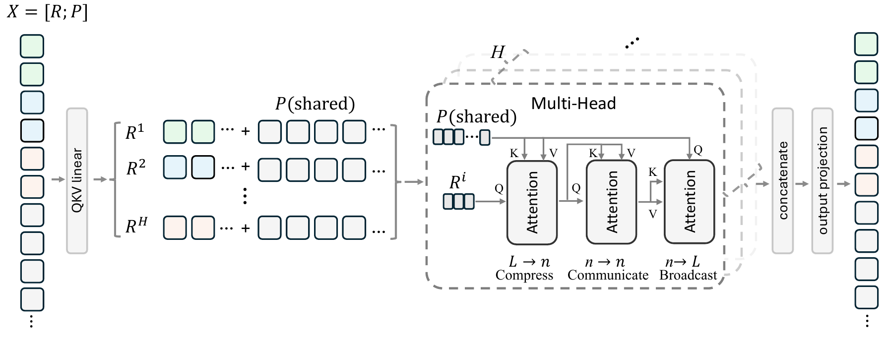
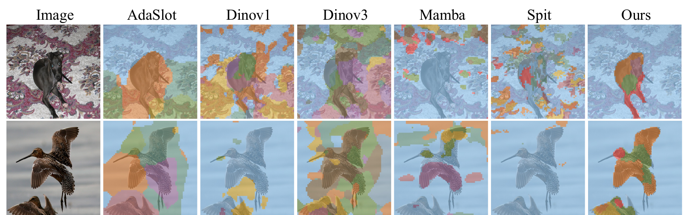
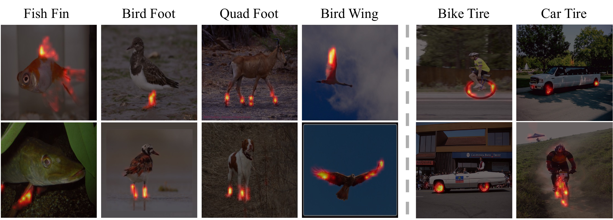

# RATS! Patches Talk Through Registers

### Emergent Parts in Register Attention Transformers

[](https://github.com/yangtiming/RATS)
[](https://huggingface.co/yangtiming/RATS)
[](https://huggingface.co/spaces/yangtiming/RATS)

> Timing Yang¹, Predrag Neskovic¹, Jansen Seheult², Wenchao Han², Anand Bhattad¹, Alan Yuille¹, Feng Wang¹\*
>
> ¹ Johns Hopkins University &nbsp;&nbsp; ² Mayo Clinic
>
> \*Corresponding author: `wangf3014@gmail.com`

> 🚧 **Coming soon:** code, checkpoints, and the demo will be released around June 20.

---

<p align="center">
  
</p>

## Overview

When humans see a bird, they recognize far more than just "bird" — they see a head, wings,
and talons, a structured assembly of reusable parts that can be identified across every bird
they have ever seen. We ask whether a self-supervised visual model can discover the same
compositional structure on its own. To this end, we propose **RATS** (**R**egister
**A**ttention **T**ransformer**s**), which decomposes the classification token into *N*
learnable register tokens that route patch information through an *L → N → N → L* bottleneck.
The *N* registers are hard-partitioned across *H* attention heads, structurally isolating each
subset in an independent projection subspace. Without auxiliary losses or part annotations,
each register spontaneously specializes into a semantically coherent visual part. RATS
surpasses all baselines by an average of +12 mIoU on five segmentation benchmarks, and
demonstrates stronger dense prediction on ADE20K (+1.11 mIoU) and COCO (+0.2 AP<sup>m</sup>).
The visual dictionary extracted from the trained registers also shows signs of part-level
consistency and semantic proximity across related categories. Our results suggest that RATS
may provide a useful architectural prior for structured and interpretable visual
representation learning.

## Method

<p align="center">
  
</p>

Each transformer block routes patch–patch communication through `N` register tokens via a
three-step **compress → communicate → broadcast** attention:

1. **Compress** — patches aggregate into `N` registers (`L → N`).
2. **Communicate** — registers exchange information among themselves (`N → N`).
3. **Broadcast** — registers send information back to patches (`N → L`).

The `N` registers are partitioned **exclusively** across the `H` attention heads, so each
head owns an independent register subset with no cross-head communication — structurally
guaranteeing diversity and letting part-level specialization emerge naturally.

## Visualization

<p align="center">
  
</p>

Unsupervised part segmentations from RATS compared against baselines — each register surfaces
a semantically coherent part without any annotation.

## Visual Dictionary

<p align="center">
  
</p>

Per-register similarity maps over the patch grid recover semantic parts, which we catalog
into a small dictionary of reusable **part entries**. Built without any part-level
supervision, this dictionary reveals a multi-level semantic organization:

- **Within-super-category consistency** — a single entry fires on the *same* part across
  different instances (e.g. *Bird_Head*, *Fish_Head*, *Aero_Tail*), closely matching
  human-annotated boundaries despite never seeing those labels.
- **Taxonomic proximity** — related categories share entries: *Snake_Head* and
  *Reptile_Head* transfer bidirectionally across turtles, lizards, and chameleons.
- **Functional analogy** — geometrically similar parts cluster together, so a *Car_Tire*
  entry also localizes bicycle, bus, and race-car wheels.

These patterns show the entries are genuinely reusable part concepts that emerge purely from
the register bottleneck.

## Installation

```bash
git clone https://github.com/yangtiming/RATS.git
cd RATS
pip install -r requirements.txt
```

## Citation

```bibtex
@article{yang2026rats,
  title   = {RATS! Patches Talk Through Registers: Emergent Parts in Register Attention Transformers},
  author  = {Yang, Timing and Neskovic, Predrag and Seheult, Jansen and Han, Wenchao
             and Bhattad, Anand and Yuille, Alan and Wang, Feng},
  journal = {arXiv preprint arXiv:XXXX.XXXXX},
  year    = {2026}
}
```

## License

MIT
